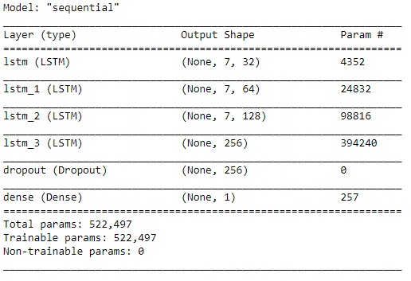

# Bangladesh Solar Irradiation Prediction - GHI vs DateTime - Time Series - Stacked LSTM - Tensorflow/Keras
## Small Project - July 2022

### Data Collection:
- Collected data from [NSRDB(National Solar Radiation Database)](https://nsrdb.nrel.gov/) website.
- Got Asia/Pacific Himawari Solar Data of 4 Regions of Bangladesh - Chittagong(CTG), Khulna(KHU), Sylhet(SYL), Rajshahi(Raj)
- Used Features - Year (2018-2020), GHI(target)

### Data Processing:
- Convert Year-Month-Day-Hour individual columns to single datetime columns
- MinMax Scaling
- 7:3 Train-Test Ratio

### Stacked LSTM Model:

### Predictions:

RMSE (CTG): 424.39
RMSE (KHU): 421.20
RMSE (SYL): 434.22
RMSE (RAJ): 424.39

